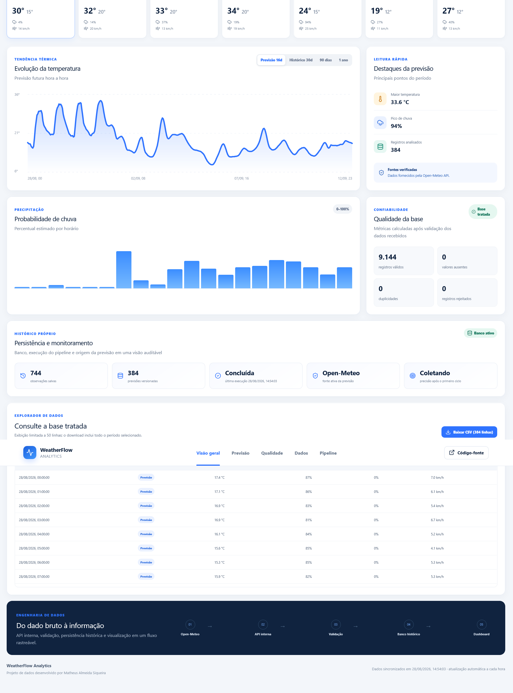
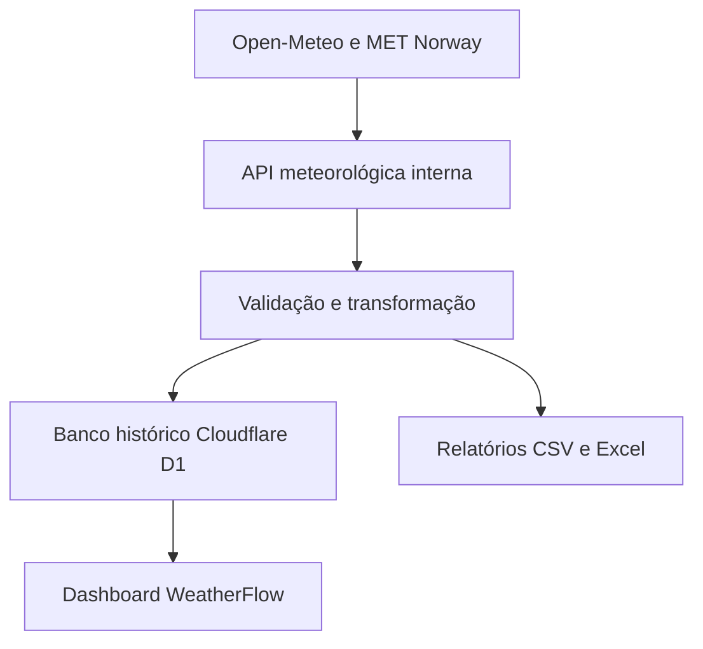

# WeatherFlow Analytics

[](https://github.com/MatheusAlmeidaSiqueira/data-automation/actions/workflows/tests.yml)


Plataforma de engenharia e análise de dados meteorológicos desenvolvida para coletar, transformar, validar, armazenar e visualizar dados reais de Guarulhos — SP.

O projeto combina um pipeline ETL em Python, uma API interna, banco de dados histórico e uma plataforma web interativa. A aplicação oferece indicadores meteorológicos, análise histórica, previsão do tempo, índice de risco climático, monitoramento do pipeline e exportação de dados.

🌐 **Plataforma publicada:**

[matheus-analytics-guarulhos.matheusalmeidasiquei.chatgpt.site](https://matheus-analytics-guarulhos.matheusalmeidasiquei.chatgpt.site)

## Demonstração da plataforma

[](https://matheus-analytics-guarulhos.matheusalmeidasiquei.chatgpt.site)

> Dashboard com dados meteorológicos reais, previsão diária, histórico analítico, indicadores de qualidade e monitoramento automatizado do pipeline.

---

## Visão geral

O WeatherFlow Analytics foi desenvolvido como um projeto completo de portfólio em engenharia de dados e desenvolvimento de software.

A aplicação consome dados meteorológicos reais da Open-Meteo e utiliza o MET Norway como fonte de contingência. Os dados passam por processos de extração, validação, transformação e persistência antes de serem apresentados na plataforma.

O projeto demonstra conhecimentos em:

- Python e automação;
- pipelines ETL;
- tratamento e validação de dados;
- SQL e persistência histórica;
- APIs e integração de sistemas;
- testes automatizados;
- análise de dados meteorológicos;
- visualização de dados;
- React e TypeScript;
- Git, GitHub e integração contínua;
- organização profissional de software.

---

## Funcionalidades

### Dados e automação

- Coleta de dados meteorológicos reais;
- Atualização automática das informações;
- Coleta horária independente de acessos por GitHub Actions;
- Fonte principal pela Open-Meteo;
- Contingência independente pela API oficial MET Norway;
- Validação e rejeição de registros inválidos;
- Persistência de observações e previsões;
- Registro auditável das execuções do pipeline;
- Geração de arquivos CSV e relatórios em Excel.

### Plataforma analítica

- Indicadores de temperatura, umidade, chuva e vento;
- Previsão meteorológica para os próximos dias;
- Consulta de dados históricos;
- Gráficos interativos de temperatura e precipitação;
- Filtros de 16 dias, 30 dias, 90 dias e 1 ano;
- Pesquisa de registros por data;
- Métricas de qualidade dos dados;
- Exportação completa para CSV;
- Interface responsiva para computador, tablet e celular.

### Indicador exclusivo

O **WeatherFlow Risk Index** transforma chuva, vento e amplitude térmica em uma pontuação de risco meteorológico de 0 a 100.

O indicador foi desenvolvido para facilitar a interpretação das condições previstas nas próximas 24 horas.

---

## Arquitetura



O sistema está dividido em quatro partes principais:

### Pipeline de dados

Responsável pela extração, limpeza, validação, transformação e exportação dos dados meteorológicos.

### API interna

Centraliza a consulta das fontes meteorológicas, aplica contingência e fornece dados padronizados para o frontend.

### Banco histórico

Armazena observações, previsões e execuções do pipeline em tabelas versionadas por migrações SQL.

### Plataforma web

Apresenta indicadores, gráficos, previsões, filtros, análises e downloads em uma interface responsiva.

---

## Tecnologias

### Dados e automação

- Python 3.11;
- Pandas;
- Requests;
- OpenPyXL;
- PyTest;
- Plotly;
- Open-Meteo API;
- MET Norway Locationforecast API.

### Plataforma web

- TypeScript;
- React;
- Next.js;
- Vinext;
- Tailwind CSS;
- Shadcn UI;
- Lucide Icons;
- Cloudflare Workers;
- Cloudflare D1;
- Drizzle ORM.

### Qualidade e versionamento

- Git;
- GitHub;
- GitHub Actions;
- ESLint;
- testes automatizados;
- migrações SQL versionadas;
- integração contínua.

---

## Estrutura do projeto

```text
data-automation/
├── .github/
│   └── workflows/
│       ├── tests.yml
│       └── collect-weather.yml
├── .streamlit/
├── data/
│   ├── raw/
│   └── processed/
├── docs/
│   └── weatherflow-dashboard.png
├── frontend/
│   ├── app/
│   │   └── api/
│   ├── components/
│   ├── db/
│   ├── drizzle/
│   ├── public/
│   ├── scripts/
│   │   └── setup-local-db.py
│   ├── tests/
│   └── package.json
├── notebooks/
├── reports/
├── src/
│   └── data_automation/
│       ├── config.py
│       ├── extract.py
│       ├── transform.py
│       ├── load.py
│       ├── pipeline.py
│       └── visualization.py
├── tests/
├── app.py
├── pytest.ini
├── requirements.txt
├── LICENSE
└── README.md
```

---

## Executando o pipeline Python

Clone o projeto:

```bash
git clone https://github.com/MatheusAlmeidaSiqueira/data-automation.git
cd data-automation
```

Crie o ambiente virtual:

```bash
python -m venv .venv
```

Ative o ambiente no Windows:

```bat
.venv\Scripts\activate
```

Instale as dependências:

```bash
python -m pip install -r requirements.txt
```

Configure o caminho dos módulos no Windows:

```bat
set PYTHONPATH=src
```

Execute o pipeline:

```bash
python -m data_automation
```

Os arquivos gerados ficam disponíveis em:

```text
data/processed/weather_data.csv
data/processed/weather_report.xlsx
```

---

## Executando o dashboard Streamlit

Na pasta principal do projeto, execute:

```bash
streamlit run app.py
```

A aplicação será aberta em:

```text
http://localhost:8501
```

---

## Executando a plataforma web localmente

### Pré-requisitos

- Node.js 22 ou superior;
- npm;
- Python 3.11 ou superior;
- Git for Windows, incluindo Git Bash.

Entre na pasta do frontend:

```bash
cd frontend
```

Instale as dependências:

```bash
npm ci
```

Inicie a plataforma:

```bash
npm run dev
```

Acesse no navegador:

```text
http://localhost:5173
```

### Preparação do banco D1 local

Na primeira execução, mantenha a plataforma aberta e abra um segundo terminal na pasta `frontend`.

Execute:

```bash
npm run db:local
```

O comando localiza automaticamente o banco D1 criado pelo ambiente de desenvolvimento e aplica somente as migrações pendentes.

Depois, atualize a página no navegador.

Nas próximas execuções, normalmente será necessário apenas:

```bash
npm run dev
```

### Comandos disponíveis

| Comando            | Finalidade                                |
| ------------------ | ----------------------------------------- |
| `npm run dev`      | Inicia a plataforma em desenvolvimento    |
| `npm run db:local` | Prepara e atualiza o banco D1 local       |
| `npm run build`    | Gera a versão de produção                 |
| `npm run lint`     | Verifica a qualidade do código frontend   |
| `npm test`         | Executa o build e os testes automatizados |

> No Windows, o comando `npm test` precisa do Git Bash disponível no `PATH`, pois o processo de build utiliza scripts Bash.

---

## Testes automatizados

Execute os testes do pipeline Python:

```bash
pytest -v
```

Os testes verificam:

- transformação e limpeza dos dados;
- rejeição de respostas inválidas;
- geração do resumo diário;
- criação dos arquivos CSV e Excel;
- geração das visualizações.

Para validar o frontend:

```bash
cd frontend
npm ci
npm run lint
npm test
```

A suíte do frontend verifica:

- consumo da API meteorológica interna;
- validação e persistência dos registros;
- estrutura das migrações do banco;
- geração do build de produção.

O GitHub Actions executa automaticamente as validações de Python e frontend a cada push e pull request.

---

## Automação da coleta

O workflow `collect-weather.yml` executa a coleta meteorológica automaticamente pelo GitHub Actions.

Essa automação permite atualizar o histórico mesmo quando nenhum usuário acessa a plataforma.

A execução também pode ser iniciada manualmente na área **Actions** do repositório.

---

## Banco de dados

O projeto utiliza Cloudflare D1, baseado em SQLite, para armazenar:

- observações meteorológicas;
- previsões;
- fonte utilizada em cada consulta;
- execuções do pipeline;
- status das atualizações;
- registros necessários para auditoria.

As alterações estruturais são controladas por migrações SQL versionadas na pasta:

```text
frontend/drizzle/
```

---

## Dados e relatórios

Os dados são obtidos pela API pública Open-Meteo, com contingência pela API oficial MET Norway quando a fonte principal estiver temporariamente indisponível.

Os relatórios locais são gerados nos formatos:

- CSV, para análise e integração;
- Excel, para consulta e apresentação.

Os arquivos gerados ficam apenas no ambiente local e não são enviados ao GitHub. Isso mantém o repositório leve e permite que os relatórios sejam atualizados sempre que o pipeline for executado.

---

## Diferenciais técnicos

- Separação clara entre extração, transformação, carregamento e visualização;
- arquitetura modular;
- validação de registros incompletos;
- métricas de qualidade dos dados;
- API interna executada no servidor;
- contingência entre fontes meteorológicas;
- banco histórico com migrações versionadas;
- armazenamento de previsões para auditoria;
- automação independente de acessos;
- monitoramento das execuções;
- testes automatizados;
- dashboard responsivo;
- exportação de dados;
- integração contínua com GitHub Actions;
- ambiente local compatível com Windows;
- frontend independente do pipeline Python.

---

## Próximas evoluções

- Comparação entre previsão armazenada e condição observada;
- cálculo de métricas de precisão meteorológica;
- alertas automáticos para falhas nas fontes de dados;
- painel de disponibilidade das integrações;
- expansão configurável para outras cidades brasileiras;
- autenticação para recursos administrativos.

---

## Autor

**Matheus Almeida Siqueira**

Estudante de Engenharia de Software e Eletrônica Industrial, com interesse em desenvolvimento de software, engenharia de dados, automação e inteligência artificial.

- [GitHub](https://github.com/MatheusAlmeidaSiqueira)
- [WeatherFlow Analytics](https://matheus-analytics-guarulhos.matheusalmeidasiquei.chatgpt.site)

---

## Licença

Distribuído sob a licença MIT. Consulte o arquivo [LICENSE](LICENSE).
