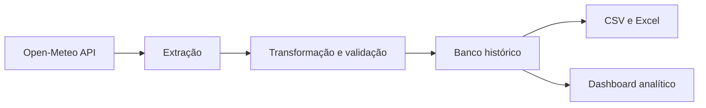

# WeatherFlow Analytics

[](https://github.com/MatheusAlmeidaSiqueira/data-automation/actions/workflows/tests.yml)


Plataforma de engenharia e análise de dados meteorológicos desenvolvida para coletar, transformar, validar e visualizar dados reais de Guarulhos — SP.

O projeto combina um pipeline ETL em Python com uma plataforma web interativa, oferecendo indicadores meteorológicos, análise histórica, previsão do tempo, índice de risco climático e exportação de dados.

🌐 **Plataforma publicada:**
[matheus-analytics-guarulhos.matheusalmeidasiquei.chatgpt.site](https://matheus-analytics-guarulhos.matheusalmeidasiquei.chatgpt.site)

---

## Visão geral

O WeatherFlow Analytics foi desenvolvido como um projeto completo de portfólio em engenharia de dados e desenvolvimento de software.

A aplicação consome dados reais da Open-Meteo e usa o MET Norway como contingência independente, executa processos de validação e transformação e apresenta as informações em dashboards interativos.

O projeto demonstra conhecimentos em:

- Python e automação;
- pipelines ETL;
- tratamento e validação de dados;
- testes automatizados;
- análise de dados meteorológicos;
- visualização de dados;
- desenvolvimento frontend com React e TypeScript;
- Git, GitHub e integração contínua;
- organização profissional de software.

---

## Funcionalidades

- Coleta de dados meteorológicos reais;
- Atualização automática das informações;
- Coleta horária independente de acessos por GitHub Actions;
- Monitoramento da última execução e da fonte meteorológica ativa;
- API interna para centralizar a integração meteorológica;
- Persistência de observações e previsões em banco de dados;
- Registro auditável das execuções do pipeline;
- Consulta de milhares de registros históricos;
- Previsão meteorológica para os próximos dias;
- Indicadores de temperatura, umidade, chuva e vento;
- WeatherFlow Risk Index para análise de risco climático;
- Gráficos interativos de temperatura e precipitação;
- Filtros de 16 dias, 30 dias, 90 dias e 1 ano;
- Pesquisa de registros por data;
- Validação e rejeição de registros inválidos;
- Cálculo da qualidade dos dados;
- Exportação completa para CSV;
- Geração de relatórios em Excel;
- Interface responsiva para computador, tablet e celular;
- Testes automatizados do pipeline e da visualização.

---

## Arquitetura



O sistema está dividido em duas partes principais:

### Pipeline de dados

Responsável pela extração, limpeza, validação, transformação e exportação dos dados meteorológicos.

### Plataforma web

Responsável por apresentar os indicadores, gráficos, previsões, filtros, análises e downloads em uma interface profissional.

---

## Tecnologias

### Dados e automação

- Python 3.11
- Pandas
- Requests
- OpenPyXL
- PyTest
- Plotly
- Open-Meteo API
- MET Norway Locationforecast API

### Plataforma web

- TypeScript
- React
- Next.js
- Vinext
- Tailwind CSS
- Shadcn UI
- Lucide Icons
- Cloudflare Workers
- Cloudflare D1
- Drizzle ORM

### Qualidade e versionamento

- Git
- GitHub
- GitHub Actions
- ESLint
- Testes automatizados

---

## Estrutura do projeto

```text
data-automation/
├── .github/
│   └── workflows/            # Integração contínua
├── .streamlit/               # Configuração do dashboard Python
├── data/
│   ├── raw/                  # Dados brutos locais
│   └── processed/            # Dados processados
├── frontend/                 # Plataforma web profissional
│   ├── app/
│   ├── components/
│   ├── public/
│   ├── tests/
│   └── package.json
├── notebooks/                # Análises exploratórias
├── reports/                  # Relatórios gerados
├── src/
│   └── data_automation/
│       ├── config.py
│       ├── extract.py
│       ├── transform.py
│       ├── load.py
│       ├── pipeline.py
│       └── visualization.py
├── tests/                    # Testes do pipeline Python
├── app.py                    # Aplicação Streamlit
├── pytest.ini
└── requirements.txt
```

---

## Executando o pipeline Python

Clone o projeto:

```bash
git clone https://github.com/MatheusAlmeidaSiqueira/data-automation.git
cd data-automation
```

Crie o ambiente virtual:

```bash
python -m venv .venv
```

Ative no Windows:

```bat
.venv\Scripts\activate
```

Instale as dependências:

```bash
python -m pip install -r requirements.txt
```

Configure o caminho dos módulos no Windows:

```bat
set PYTHONPATH=src
```

Execute o pipeline:

```bash
python -m data_automation
```

---

## Executando o dashboard Streamlit

```bash
streamlit run app.py
```

A aplicação será aberta no navegador em:

```text
http://localhost:8501
```

---

## Executando a plataforma web localmente

### Pré-requisitos

- Node.js 22 ou superior;
- npm;
- Python 3.11 ou superior;
- Git for Windows, incluindo Git Bash.

Entre na pasta do frontend:

```bash
cd frontend
```

Instale as dependências:

```bash
npm ci
```

Inicie a plataforma:

```bash
npm run dev
```

Acesse no navegador:

```text
http://localhost:5173
```

### Preparação do banco D1 local

Na primeira execução, mantenha a plataforma aberta e abra um segundo terminal na pasta `frontend`.

Execute:

```bash
npm run db:local
```

Esse comando localiza automaticamente o banco D1 criado pelo ambiente de desenvolvimento e aplica apenas as migrações pendentes.

Depois, atualize a página no navegador.

Nas próximas execuções, normalmente será necessário apenas:

```bash
npm run dev
```

### Comandos disponíveis

| Comando            | Finalidade                                |
| ------------------ | ----------------------------------------- |
| `npm run dev`      | Inicia a plataforma em desenvolvimento    |
| `npm run db:local` | Prepara e atualiza o banco D1 local       |
| `npm run build`    | Gera a versão de produção                 |
| `npm test`         | Executa o build e os testes automatizados |

> No Windows, execute `npm test` com o Git Bash disponível no `PATH`, pois o processo de build utiliza scripts Bash.

---

## Testes automatizados

Execute os testes Python:

```bash
pytest -v
```

Os testes verificam:

- transformação e limpeza dos dados;
- rejeição de respostas inválidas;
- geração do resumo diário;
- criação dos arquivos CSV e Excel;
- geração das visualizações;
- componentes principais da interface.

Para validar lint, testes e build do frontend:

```bash
cd frontend
npm ci
npm run lint
npm test
```

O GitHub Actions executa automaticamente as validações de Python e frontend a cada push e pull request.

---

## Dados

Os dados são obtidos da API pública Open-Meteo, com contingência pela API oficial MET Norway quando a fonte principal estiver temporariamente limitada.

Os arquivos CSV e Excel gerados pelo pipeline ficam armazenados apenas no ambiente local e não são enviados ao GitHub.

Isso mantém o repositório leve e permite que os relatórios sejam atualizados sempre que o pipeline for executado.

---

## Diferenciais técnicos

- Separação clara entre extração, transformação, carregamento e visualização;
- Código modular e organizado;
- Validação de registros incompletos;
- Métricas de qualidade dos dados;
- Testes automatizados;
- Atualização de dados reais;
- Dashboard responsivo;
- Exportação de dados;
- Integração contínua com GitHub Actions;
- Frontend independente do pipeline Python.
- API interna em execução server-side;
- Banco histórico com migrações versionadas;
- Armazenamento de previsões para auditoria e cálculo futuro de precisão.

---

## Próximas evoluções

- Coleta agendada independente dos acessos à plataforma;
- Evolução das métricas de precisão conforme o histórico próprio cresce;
- Alertas automáticos para falhas nas fontes de dados;
- Expansão configurável para outras cidades brasileiras.

---

## Autor

**Matheus Almeida Siqueira**

Estudante de Engenharia de Software e Eletrônica Industrial, com interesse em desenvolvimento de software, engenharia de dados, automação e inteligência artificial.

- [GitHub](https://github.com/MatheusAlmeidaSiqueira)
- [WeatherFlow Analytics](https://matheus-analytics-guarulhos.matheusalmeidasiquei.chatgpt.site)

---

## Licença

Distribuído sob a licença MIT. Consulte o arquivo [LICENSE](LICENSE).
